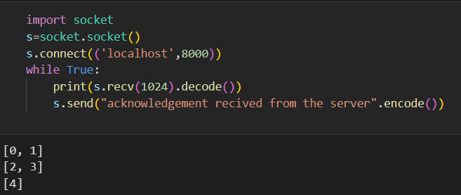
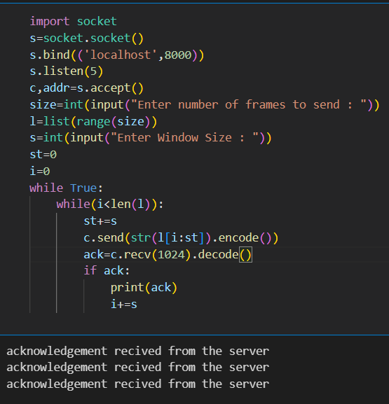

# EX-3 IMPLEMENTATION OF SLIDING WINDOW PROTOCOL

# DATE : 20-03-2023


# AIM :
### To write a python program to perform sliding window protocol

# ALGORITHM :
### Start the program.
### Get the frame size from the user
### To create the frame based on the user request.
### To send frames to server from the client side.
### If your frames reach the server it will send ACK signal to client otherwise it will send NACKsignal to client.
### Stop the program.


# CLIENT PROGRAM :
```PY
## Developed : SOUVIK KUNDU
## Reg no : 212221230105
import socket
s=socket.socket()
s.bind(('localhost',8000))
s.listen(5)
c,addr=s.accept()
size=int(input("Enter number of frames to send : "))
l=list(range(size))
s=int(input("Enter Window Size : "))
st=0
i=0
while True:
    while(i<len(l)):
        st+=s
        c.send(str(l[i:st]).encode())
        ack=c.recv(1024).decode()
        if ack:
            print(ack)
            i+=s


```
# SERVER PROGRAM :
```PY

import socket
s=socket.socket()
s.connect(('localhost',8000))
while True:
    print(s.recv(1024).decode())
    s.send("acknowledgement recived from the server".encode())

```


# SERVER OUTPUT :

# CLIENT OUTPUT : 



# RESULT:
### Thus, python program to perform stop and wait protocol And Sliding Window Protocol was successfully executed.


